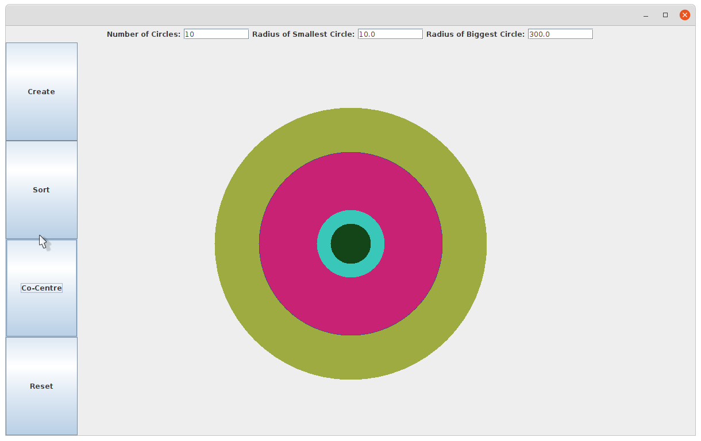

# Circle-Panel

> Create, sort and recentre colored circles.


## Fileds
* Number of Circles:
  * Entre the number of circles you want to delete.
* Radius of Smallest Circle:
  * Entre minimum radius.
* Radius of Biggest Circle:
  * Entre maximum radius.

## Buttons
* Create:
  * Generates the circles. 


* Sort:
  * Sort circles according to size.


* Co-Centre:
  * Centre the Circles.


* Reset:
  * Delete all the Circles.


## Running Program

OS X & Linux terminal:

```sh
javac *.java
java ShapeViewer
```

Windows cmd:

```sh
javac Circle.java drawCircles.java drawCircleTester.java Point.java
java ShapeViewer
```
